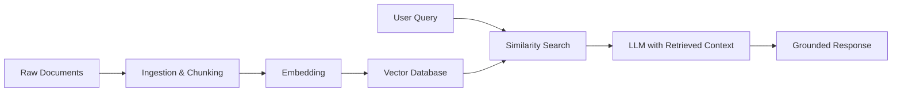

# Generative AI Systems Overview (Part 1)

Modern generative AI systems are built from several powerful but distinct ideas. This overview introduces three major pillars you will see repeatedly in real-world architectures:

1. **Language Models** – large and small models that process and generate text (and sometimes other modalities).
2. **Retrieval-Augmented Generation (RAG)** – systems that combine models with external knowledge sources such as vector databases.
3. **Agentic Systems** – model-driven components that can use tools, orchestrate workflows, and collaborate as multi-agent systems.

This lesson gives you a map of the territory so that later modules and deep dives have a clear context.

## 1. Language Models as the Foundation

At the heart of modern generative AI are **language models** trained to predict the next token in a sequence. These models come in several flavors:

- **Large Language Models (LLMs)** – high-capacity models with billions of parameters (e.g., GPT-style models, Gemini-family models, Claude-family models). They are capable of sophisticated reasoning, code generation, and multi-turn dialogue.
- **Smaller or domain-specific models** – compact models fine-tuned for narrower tasks (e.g., classification, summarization, or specialized domains) where latency, cost, or on-device deployment matters.
- **Multimodal models** – models that can process and/or generate more than one modality (text + images, text + audio, etc.). They enable use cases such as describing images, answering questions about charts, or generating visuals.
- **Reasoning-focused variants** – models and prompting techniques optimized for planning, tool selection, or step-by-step reasoning.

From a systems perspective, language models provide a **general-purpose reasoning and generation engine**. Everything else in modern generative AI is about:

- Supplying **better context** to the model.
- Connecting the model to **external tools** and **data sources**.
- Structuring interactions so that the model can solve complex tasks reliably.

Frameworks such as **LangChain**, **LlamaIndex**, and others provide building blocks to: 

- Call models from different providers (e.g., OpenAI, Google, Anthropic, and others).
- Standardize how prompts, tools, and retrieval components are wired together.

## 2. Retrieval-Augmented Generation and Vector Databases

Out-of-the-box language models are trained on broad internet-scale data, but they do **not** automatically know your private documents, codebases, or knowledge repositories. **Retrieval-Augmented Generation (RAG)** addresses this gap.

At a high level, a RAG system:

1. **Ingests data** from one or more sources (files, APIs, databases).
2. **Transforms** that data (chunking, cleaning, metadata enrichment).
3. **Embeds** each chunk into a high-dimensional vector representation.
4. **Stores** those vectors in a **vector database** together with relevant metadata.
5. At query time, **retrieves** the most relevant chunks using vector similarity search.
6. **Augments** the model's prompt with those retrieved chunks and then generates an answer.



```text
ASCII Fallback:

[Raw Docs] -> [Ingest/Chunk] -> [Embed] -> [Vector DB]
[User Query] -> [Similarity Search + Retrieved Chunks] -> [LLM] -> [Response]
```

Common vector databases and libraries offer:

- Efficient similarity search over millions of embedded chunks.
- Metadata-based filters (e.g., by document type, user, or timestamp).
- Integrations with model and orchestration frameworks.

A **data ingestion pipeline** for RAG typically includes:

- **Connectors** to data sources (file systems, cloud storage, wikis, code repositories).
- **Preprocessing** (splitting, cleaning, normalization, language detection).
- **Embedding & storage** into the chosen vector store.

The result is a system where the model can "consult" your own knowledge sources at inference time without retraining.

## 3. Agentic Systems and Tool-Using Models

While RAG enriches a **single model call**, many real-world tasks require **multi-step workflows**, **tool usage**, and **coordination** between different components. This is where **agentic systems** come in.

An **agentic system** typically involves one or more agents that:

- Receive goals or tasks expressed in natural language.
- Decide which tools, APIs, or services to call.
- Plan and execute multi-step workflows.
- Maintain state or memory over longer interactions.

Examples of tools an agent might use include:

- Web search or internal knowledge APIs.
- Code execution environments (e.g., Python sandboxes).
- Databases or vector stores.
- Enterprise systems (ticketing, CRM, monitoring).

Popular frameworks provide structure for building such systems, including:

- Orchestrating **single-agent** flows (one model coordinating tools).
- Configuring **multi-agent** systems where specialized agents collaborate.
- Managing **tool schemas**, **policies**, and **safety constraints**.

As the field evolves, new frameworks and orchestration runtimes appear frequently. Instead of focusing on specific brand names, it is useful to understand the common capabilities:

- **Planning**: breaking a high-level goal into sub-tasks.
- **Tool selection**: choosing appropriate tools for each sub-task.
- **Execution**: calling tools, handling errors, and retrying when needed.
- **Coordination**: passing intermediate results between agents or steps.

## 4. How the Pillars Fit Together

The three pillars complement each other rather than compete:

- **Language models** provide the core reasoning and generation ability.
- **RAG + vector databases** ground the model in your **current, private, or specialized data**.
- **Agentic systems** orchestrate multi-step workflows and tool usage to solve richer tasks.

Conceptually:

```text
          +--------------------------+
          |      Agentic Systems     |
          |  (planning, tools, flow) |
          +------------+-------------+
                       |
                       v
           +-----------+-----------+
           |    RAG & Retrieval    |
           |  (vector DB, context) |
           +-----------+-----------+
                       |
                       v
                 [Language Model]
```

A mature generative AI platform typically combines all three:

- A catalog of models exposed via APIs.
- A retrieval layer that knows about internal documents and data.
- An orchestration/agent layer that turns user intents into reliable workflows.

## 5. What Comes Next

This overview is intentionally high-level. Follow-up content dives deeper into each pillar:

- **Language Models** – architectures, prompt design patterns, evaluation, and safety.
- **RAG Systems** – data pipelines, chunking strategies, ranking, evaluation, and failure modes.
- **Agentic Systems** – single vs multi-agent designs, tool integration, and governance.

As you work through those modules, use this mental map to see **where each concept fits in the larger generative AI ecosystem**.
