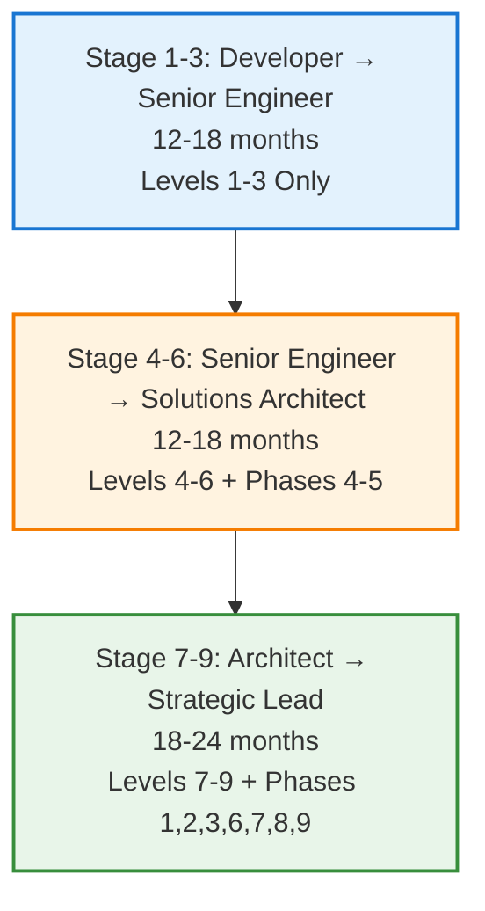

# ArchitectJourney

A comprehensive learning and reference repository for aspiring software architects — providing a structured 9-level journey from foundational development principles to strategic leadership impact.


---

## 📘 Table of Contents

- [Overview](#-overview)
- [What You'll Find](#-what-youll-find)
- [The Unified Journey](#-the-unified-journey-two-complementary-tracks)
- [Roadmap — The 9 Levels](#-roadmap--the-9-levels-of-architectjourney)
- [Learning Domains](#-learning-domains-covered)
- [Repository Structure](#-repository-structure)
- [License](#-license)

---

## 🌐 Overview

**ArchitectJourney** guides learners through progressive mastery across key architectural competencies:

- **Development Fundamentals** — Software design, patterns, clean code, and testability  
- **Programming Languages** — Python, C#, Java, Go, JavaScript/TypeScript, and frameworks  
- **AI/ML & Data Engineering** — AI foundations, machine learning, NLP, LLMs, and data pipelines  
- **Cloud Platforms** — Azure, AWS, GCP, and multi-cloud architectures  
- **DevOps & Observability** — CI/CD, Infrastructure-as-Code, monitoring, and SRE practices  
- **Enterprise Architecture** — System design, integration strategies, and high-availability patterns  
- **Leadership & Strategy** — Technology vision, organizational design, and business acumen  

---

## 🎯 What You'll Find

Each level includes:

- **Reference Materials** — Curated knowledge across 13 architectural domains  
- **Practical Projects** — Hands-on implementation exercises  
- **Design Patterns** — Proven architectural and design approaches  
- **Frameworks** — Strategic decision-making and delivery frameworks  

Whether you're deepening technical expertise, leading delivery teams, or exploring intelligent systems, **ArchitectJourney** offers a clear, future-proof roadmap for growth, innovation, and leadership.

---

## 🔄 The Unified Journey: Two Complementary Tracks

ArchitectJourney offers **two powerful learning tracks** that can be pursued independently or combined into a **unified mastery progression**:

### **Track 1: Core Architecture Path** (Skill-Building)

**9 Levels** — From developer foundations to architectural mastery  
**Focus**: Technical capabilities, system design, and architectural thinking  
**Duration**: 36-48 months  
**Outcome**: Solutions Architect, Technical Lead, Senior Engineer

### **Track 2: Lead Architect Path** (Leadership-Building)

**9 Phases** — From architectural thinking to strategic leadership  
**Focus**: Decision frameworks, organizational transformation, and strategic vision  
**Duration**: 9-12 months (intensive program for experienced architects)  
**Outcome**: Lead Architect, Principal Architect, Chief Architect, VP Technology

### **The Unified Progression** (Complete Mastery)

By combining both tracks, you can progress from **junior developer to strategic technology leader** in a single, continuous journey:



**Total Duration**: 42-60 months (3.5-5 years)

### **How the Tracks Integrate**

| Stage | Core Path (Levels) | Lead Path (Phases) | Combined Focus |
|-------|-------------------|-------------------|----------------|
| **1-4** | Technical Foundations | — | Pure skill-building |
| **5** | DevOps & CI/CD | Delivery Engine | Automation + Strategy |
| **6** | Enterprise Architecture | Scale Systems | Design + Scalability |
| **7** | AI/ML Systems | Intelligent Futures | AI Implementation + Strategy |
| **8** | Security & Governance | Data Trust | Protection + Governance |
| **9** | Leadership & Strategy | Reboot + Frameworks + Pattern Studio + Polyglot + Leadership Impact | Complete Strategic Leadership |

📖 **Learn More**:

- [01. Unified Architect Mastery Roadmap](docs/01_UnifiedArchitectMasteryRoadmap.md) — Complete 9-stage progression guide with career paths
- [02. Repository Structure](docs/02_RepositoryStructure.md) — Detailed folder organization and reference library layout

---

## 🧭 Roadmap — The 9 Levels of ArchitectJourney

The **Core Architecture Path** in ArchitectJourney is designed as a progressive, mastery-based roadmap — guiding you from **foundational development** to **architectural and strategic leadership**.  
Each level deepens technical, architectural, and strategic thinking.

### **Core Architecture Path: Levels 1–9**

| **Level** | **Focus Area** | **Key Objectives** |
|------------|----------------|--------------|
| **01** | **Foundation Mastery** | Programming fundamentals, OOP, SOLID basics, version control, testing foundations |
| **02** | **Development Patterns & Practices** | Design patterns, architectural patterns, TDD, SOLID deep dive, DDD fundamentals |
| **03** | **Programming Language Mastery** | Advanced language features, async programming, frameworks, data access, dependency management |
| **04** | **Cloud Platforms & Infrastructure** | Cloud computing models, Azure/AWS/GCP, containerization, serverless, cloud security |
| **05** | **DevOps, CI/CD & Observability** | CI/CD pipelines, IaC, continuous delivery, observability, SRE practices, incident management |
| **06** | **Enterprise Architecture & System Design** | Architecture principles, distributed systems, integration patterns, HA/DR, data architecture |
| **07** | **AI/ML & Intelligent Systems** | ML fundamentals, deep learning, LLMs, generative AI, MLOps, responsible AI |
| **08** | **Security, Governance & Compliance** | Application & infrastructure security, IAM, compliance frameworks, data protection, governance |
| **09** | **Leadership, Strategy & Innovation** | Technology strategy, organizational leadership, business acumen, stakeholder management, innovation |

### 🧭 Core Architecture Progression

```mermaid
graph LR
    A1["01️⃣ Foundation Mastery<br/><small>Programming, OOP, SOLID, Testing</small>"]
    --> A2["02️⃣ Development Patterns<br/><small>Design Patterns, TDD, DDD</small>"]
    --> A3["03️⃣ Language Mastery<br/><small>Advanced Features, Frameworks</small>"]
    --> A4["04️⃣ Cloud & Infra<br/><small>Azure, AWS, GCP, Serverless</small>"]
    --> A5["05️⃣ DevOps & Observability<br/><small>CI/CD, IaC, SRE</small>"]
    --> A6["06️⃣ Enterprise Design<br/><small>Distributed Systems, HA, DR</small>"]
    --> A7["07️⃣ AI & Intelligent Systems<br/><small>ML, LLMs, GenAI</small>"]
    --> A8["08️⃣ Security & Governance<br/><small>IAM, Compliance, Data Protection</small>"]
    --> A9["09️⃣ Leadership & Strategy<br/><small>Vision, Execution, Innovation</small>"]

    style A1 fill:#E3F2FD,stroke:#64B5F6,stroke-width:2px,color:#0D47A1
    style A9 fill:#E8F5E9,stroke:#66BB6A,stroke-width:2px,color:#1B5E20
```



---

### **Lead Architect Path: 9-Phase Intensive Program**

A specialized intensive program for experienced architects progressing to **Lead Architect** and **strategic roles** across **9 transformative phases**, each with **9 specialized clusters**.

| **Phase** | **Focus Area** | **Objective** |
|------------|----------------|--------------|
| **01** | **Reboot** | Reset mindset, establish disciplined foundations, systems thinking, innovation culture |
| **02** | **Frameworks** | Master decision frameworks, architectural patterns, resilience, security, monitoring patterns |
| **03** | **Pattern Studio** | Deep dive into creational, structural, behavioral patterns, SOLID, DDD, enterprise patterns |
| **04** | **Scale Systems** | Scalable distributed architectures, CAP theorem, data pipelines, polyglot persistence, performance |
| **05** | **Delivery Engine** | CI/CD mastery, GitOps, container orchestration, observability, incident management, disaster recovery |
| **06** | **Data Trust** | Data governance, quality, privacy/compliance, master data, analytics platforms, data security |
| **07** | **Polyglot Delivery** | Multi-language strategy, frontend/backend/mobile architecture, real-time systems, edge computing |
| **08** | **Intelligent Futures** | AI strategy, ML architecture, LLM integration, GenAI applications, AI agents, responsible AI |
| **09** | **Leadership Impact** | Technology vision, organizational design, financial acumen, stakeholder leadership, digital transformation |

> Each phase includes **9 specialized clusters** for deep mastery. Typical program duration: **9-12 months** with cohort-based learning.

### 🧭 Lead Architect Progression

```mermaid
graph LR
    B1["01️⃣ Reboot<br/><small>Mindset, Systems Thinking</small>"]
    --> B2["02️⃣ Frameworks<br/><small>Decision, Resilience, Monitoring</small>"]
    --> B3["03️⃣ Pattern Studio<br/><small>Enterprise & DDD Patterns</small>"]
    --> B4["04️⃣ Scale Systems<br/><small>Distributed, CAP, Performance</small>"]
    --> B5["05️⃣ Delivery Engine<br/><small>CI/CD, GitOps, Observability</small>"]
    --> B6["06️⃣ Data Trust<br/><small>Governance, Privacy, Quality</small>"]
    --> B7["07️⃣ Polyglot Delivery<br/><small>Multi-language, Real-time</small>"]
    --> B8["08️⃣ Intelligent Futures<br/><small>AI Strategy, GenAI, Agents</small>"]
    --> B9["09️⃣ Leadership Impact<br/><small>Vision, Design, Transformation</small>"]

    style B1 fill:#FFF3E0,stroke:#FB8C00,stroke-width:2px,color:#E65100
    style B9 fill:#E8F5E9,stroke:#43A047,stroke-width:2px,color:#1B5E20

```



---

## 📊 Learning Domains Covered

ArchitectJourney integrates knowledge across **13 comprehensive reference domains**:

1. **Development Fundamentals** — SOLID, design patterns, clean code, microservices, DDD
2. **Programming Languages** — Python, C#, Java, Go, JavaScript/TypeScript, frameworks
3. **AI, ML & Data Engineering** — AI foundations, LLMs, data pipelines, generative AI
4. **Data Science & Analytics** — Data analytics, visualization, statistical modeling, MDM
5. **Cloud Platforms** — Azure, AWS, GCP, serverless, cloud-native design
6. **DevOps, CI/CD & Observability** — Pipelines, IaC, monitoring, SRE, chaos engineering
7. **Security, Privacy & Governance** — Application/infrastructure security, IAM, compliance, GDPR
8. **Enterprise Architecture & System Design** — Architecture principles, distributed systems, integration
9. **Product Delivery & Engineering Practices** — Agile, Lean, DevSecOps, team scaling
10. **Leadership, Strategy & Business Acumen** — Technology vision, transformation, stakeholder management
11. **Networking & Infrastructure** — Networking fundamentals, edge computing, hybrid cloud
12. **Emerging Technology & Innovation** — Generative AI, blockchain, IoT, quantum computing
13. **Professional Growth & Soft Skills** — Communication, collaboration, problem-solving, leadership

---

## 📁 Repository Structure

```text
ArchitectJourney/
├── .copilot/                              # Copilot configuration and AI settings
│   └── settings.json
├── .github/                               # GitHub configuration and prompts
│   ├── copilot-instructions.md            # GitHub Copilot instructions (critical for AI)
│   └── prompts/                           # Reusable prompt templates
│       ├── smart-prompt-framework-guide.md
│       └── task-prompt.md
├── docs/                                  # Documentation and guides
│   ├── 01_UnifiedArchitectMasteryRoadmap.md  # Complete 9-stage learning roadmap
│   ├── 02_RepositoryStructure.md             # Repository organization reference
│   ├── 03_Learning-vs-Reference-Strategy.md  # Rationale for dual-folder architecture
│   ├── 03_plan.md                            # Repository consolidation plan
│   ├── 04_ChatGPTsPlans.md                   # Alternative enhancement proposals
│   ├── debugging/                         # Debugging command references
│   │   ├── README.md                      # Quick reference entry point
│   │   ├── command-reference/             # Crisp command guides
│   │   │   ├── git-commands.md
│   │   │   ├── file-operations.md
│   │   │   ├── markdown-linting.md
│   │   │   └── repository-analysis.md
│   │   └── sessions/                      # Major debugging sessions
│   └── images/                            # Architecture diagrams and assets
├── 01_Reference/                         # 📚 TIER 1: Static Knowledge Library
│   └── 02_AI-and-ML/                      # AI, ML, and data engineering (currently active)
│       ├── 01_AI-Foundations/
│       ├── 03_Deep-Learning/
│       │   └── Transformers/
│       ├── 05_Large-Language-Models/
│       └── 06_Generative-AI/
├── 02_Learning/                          # 🎓 TIER 2: Progressive Learning Paths
│   ├── 01_Core-Architecture-Path/         # Levels 1-9: Developer to Architect
│   └── 02_Lead-Architect-Path/            # Phases 1-9: Architect to Enterprise Leader
├── 03_Interview-Prep/                    # 🎯 Interview Preparation Materials
│   ├── 01_System-Design/                  # System design questions & solutions
│   ├── 02_Behavioral/                     # Behavioral interview prep
│   ├── 03_Technical-Questions/           # Coding & technical questions
│   ├── 04_Mock-Interviews/                # Practice scenarios
│   └── 05_Company-Specific/               # Company-specific prep
└── tools/                                 # 🔧 Automation and utility scripts
    └── psscripts/                         # PowerShell automation scripts
        ├── Get-FileStats.ps1              # File statistics analysis
        ├── Get-MarkdownSummary.ps1        # Markdown file analysis
        ├── Get-RepoStats.ps1              # Repository overview
        ├── Compare-DocFiles.ps1           # Compare multiple files
        ├── Find-DuplicateContent.ps1      # Find duplicate headings
        ├── Quick-HealthCheck.ps1          # Fast workspace health check
        └── README.md                      # Scripts documentation
```

### 🎯 Strategic Architecture

The repository uses a **dual-folder approach** at the root level:

- **`01_Reference/`** — Static knowledge library for immediate lookup without dependencies
- **`02_Learning/`** — Sequential, scaffolded learning paths with prerequisites and progressive skill-building
- **`03_Interview-Prep/`** — Time-bound interview preparation materials for architecture and technical roles

This design serves different learning modalities and supports professionals at all career stages. See [`docs/03_Learning-vs-Reference-Strategy.md`](docs/03_Learning-vs-Reference-Strategy.md) for the complete rationale.

### 📊 Current Implementation Status

| Component | Status | Description |
|-----------|---------|-------------|
| **Documentation Hub** | ✅ Active | Complete roadmap, structure guide, and strategic rationale |
| **AI/ML Reference** | ✅ Active | AI terminology, Transformers vs LLMs, GenAI landscape |
| **Core Learning Path** | 🏗️ Planned | 9-level progression from developer to architect |
| **Lead Architect Path** | 🏗️ Planned | 9-phase leadership and strategic program |
| **Interview Preparation** | ✅ Active | System design, behavioral, and technical interview prep |
| **Automation Scripts** | ✅ Active | PowerShell tools for repository management |
| **Unified Roadmap** | 📋 Designed | Integration layer combining Learning + Reference |

> **Next Phase**: Implementation of UnifiedRoadmap structure to bridge Learning and Reference libraries into cohesive career progression stages.`

---

## 📜 License

This project is licensed under the terms specified in the [LICENSE](LICENSE) file.

---

> 🧠 **ArchitectJourney** — Designed and maintained by *Viswanatha Swamy P K*  
> Empowering developers to evolve into visionary architects and technical leaders.  
> © 2025 Sri Vari Software Solutions
