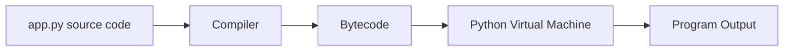

# Python Execution Model: From Source to Running Code (Part 1)

> How does Python turn a `.py` file into running code?

This lesson gives a high-level, implementation-agnostic view of how CPython (the most common Python implementation) executes your programs. You will see why Python is often called an "interpreted language", yet still performs a compilation step behind the scenes.

## 1. The Big Picture

When you run a Python script like `app.py`, several steps happen:

1. You write **source code** in a `.py` file.
2. Python **compiles** that source code into **bytecode**.
3. The **Python Virtual Machine (PVM)** **interprets** the bytecode instruction by instruction.
4. Your program produces output (e.g., prints text, writes to a file, sends a network request).

At a high level:



```text
ASCII Fallback:

[app.py] --(compile)--> [Bytecode] --(interpret)--> [Python VM] --(execute)--> [Output]
```

Python is called **compiled** because of step 2 (source → bytecode) and **interpreted** because of step 3 (bytecode → executed by the VM).

## 2. Source Code and .py Files

Your starting point is always **source code**:

```python
# app.py
print("Hello, Python!")
```

Key points:

- The `.py` extension tells tooling (editors, linters, Python itself) that this is a Python source file.
- Source code is what you write and read as a human: meaningful names, comments, and structure.
- Python will never execute this text directly; it always goes through an internal representation first.

## 3. Compilation to Bytecode

When you run:

```bash
python app.py
```

CPython performs a **compilation step**:

- It parses your source code and checks for basic syntax errors.
- If the code is syntactically valid, CPython translates it into **bytecode instructions**.

**Bytecode** is:

- A **lower-level**, more compact representation of your program.
- **Platform independent**: the same bytecode can run on Windows, macOS, or Linux, as long as there is a compatible Python interpreter.
- Not meant to be edited by hand.

In many cases, CPython may also cache this bytecode in `.pyc` files (under a `__pycache__` folder) to avoid recompiling unchanged modules.

You can think of bytecode as "Python's own internal instruction set" for your program.

## 4. Interpretation by the Python Virtual Machine

Once bytecode is ready, the **Python Virtual Machine (PVM)** takes over:

1. The VM reads bytecode instructions one by one.
2. For each instruction, it performs the corresponding operation (e.g., load a constant, call a function, jump to another instruction).
3. It manages the Python runtime: objects, memory, function calls, exceptions, and more.

Conceptually:

```text
Bytecode  →  Python VM  →  Actual CPU instructions
```

The VM acts as a layer between your Python bytecode and the underlying hardware/operating system. It "interprets" what each bytecode instruction means and executes the appropriate low-level operations.

This is why Python is often described as **interpreted**: you do not compile to a standalone native executable; instead, the interpreter (VM) must be present to run your bytecode.

## 5. Why Python Is Both Compiled and Interpreted

From the execution model:

- **Compiled aspect**:
  - Python compiles `.py` files into **bytecode**.
  - Syntax errors are typically caught during this compilation phase.
- **Interpreted aspect**:
  - The bytecode is **not** run directly by your CPU.
  - The Python VM reads and executes bytecode instructions at runtime.

So, it is reasonable to say that CPython:

- **Compiles** source code → bytecode
- **Interprets** bytecode → actions on your machine

This hybrid model is common in many high-level languages (for example, Java also compiles to bytecode and runs on a virtual machine).

## 6. Practical Mental Model

When you run a Python script, use this simple mental model:

1. "Python checks my code and turns it into bytecode."
2. "The Python VM walks through that bytecode and performs the actions I described."

You do **not** need to manage bytecode manually for everyday programming, but understanding this flow helps you:

- Reason about performance (e.g., why startup time matters).
- Understand why a Python version upgrade may change bytecode format.
- See how tools like debuggers and profilers integrate with the interpreter.

## 7. Next Steps

After understanding the basic execution model, good next topics are:

- How Python manages **modules** and **imports**.
- What `.pyc` and `__pycache__` are in more detail.
- How different Python implementations (e.g., CPython, PyPy) handle execution.

These topics build directly on the idea that your Python code flows through **source → bytecode → virtual machine** before it ever runs on your hardware.
