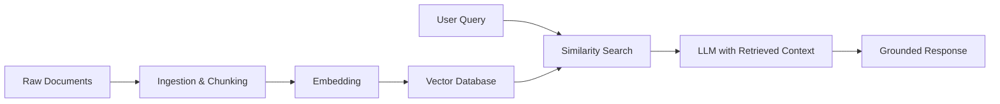

# Generative AI Systems Overview (Part 1)

Modern generative AI systems are built from several powerful but distinct ideas. This overview introduces three major pillars you will see repeatedly in real-world architectures:

1. **Language Models** – large and small models that process and generate text (and sometimes other modalities).
2. **Retrieval-Augmented Generation (RAG)** – systems that combine models with external knowledge sources such as vector databases.
3. **Agentic Systems** – model-driven components that can use tools, orchestrate workflows, and collaborate as multi-agent systems.

This lesson gives you a map of the territory so that later modules and deep dives have a clear context.

## 1. Language Models as the Foundation

At the heart of modern generative AI are **language models** trained to predict the next token in a sequence. These models come in several flavors:

- **Large Language Models (LLMs)** – high-capacity models with billions of parameters (e.g., GPT-style models, Gemini-family models, Claude-family models). They are capable of sophisticated reasoning, code generation, and multi-turn dialogue.
- **Smaller or domain-specific models** – compact models fine-tuned for narrower tasks (e.g., classification, summarization, or specialized domains) where latency, cost, or on-device deployment matters.
- **Multimodal models** – models that can process and/or generate more than one modality (text + images, text + audio, etc.). They enable use cases such as describing images, answering questions about charts, or generating visuals.
- **Reasoning-focused variants** – models and prompting techniques optimized for planning, tool selection, or step-by-step reasoning.

From a systems perspective, language models provide a **general-purpose reasoning and generation engine**. Everything else in modern generative AI is about:

- Supplying **better context** to the model.
- Connecting the model to **external tools** and **data sources**.
- Structuring interactions so that the model can solve complex tasks reliably.

Frameworks such as **LangChain**, **LlamaIndex**, and others provide building blocks to: 

- Call models from different providers (e.g., OpenAI, Google, Anthropic, and others).
- Standardize how prompts, tools, and retrieval components are wired together.

## 2. Retrieval-Augmented Generation and Vector Databases

Out-of-the-box language models are trained on broad internet-scale data, but they do **not** automatically know your private documents, codebases, or knowledge repositories. **Retrieval-Augmented Generation (RAG)** addresses this gap.

At a high level, a RAG system:

1. **Ingests data** from one or more sources (files, APIs, databases).
2. **Transforms** that data (chunking, cleaning, metadata enrichment).
3. **Embeds** each chunk into a high-dimensional vector representation.
4. **Stores** those vectors in a **vector database** together with relevant metadata.
5. At query time, **retrieves** the most relevant chunks using vector similarity search.
6. **Augments** the model's prompt with those retrieved chunks and then generates an answer.



```text
ASCII Fallback:

[Raw Docs] -> [Ingest/Chunk] -> [Embed] -> [Vector DB]
[User Query] -> [Similarity Search + Retrieved Chunks] -> [LLM] -> [Response]
```

Common vector databases and libraries offer:

- Efficient similarity search over millions of embedded chunks.
- Metadata-based filters (e.g., by document type, user, or timestamp).
- Integrations with model and orchestration frameworks.

A **data ingestion pipeline** for RAG typically includes:

- **Connectors** to data sources (file systems, cloud storage, wikis, code repositories).
- **Preprocessing** (splitting, cleaning, normalization, language detection).
- **Embedding & storage** into the chosen vector store.

The result is a system where the model can "consult" your own knowledge sources at inference time without retraining.

## 🔗 Related Documents

- [Part 1-B: Agentic Systems and Integration](./01_Generative-AI-Systems-Overview-Part1-B.md) - Agentic systems and how pillars fit together
- [RAG Architecture Fundamentals](./03_RAG-Architecture-Fundamentals-Part1-A.md) - Deep dive into RAG systems
