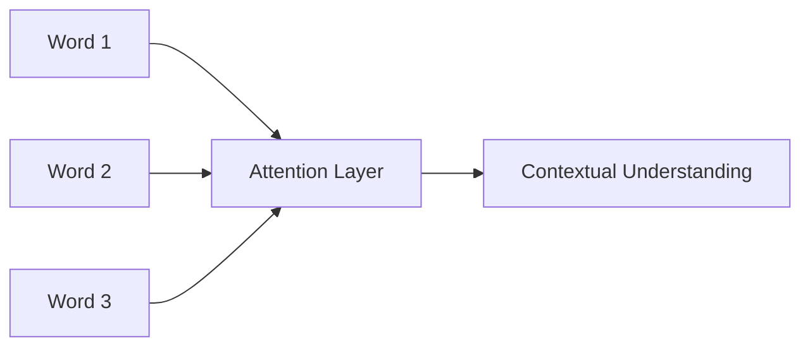

# Language Models Fundamentals (Part 1-A)

## What is a Language Model?

A **language model** is a machine learning system trained to understand, generate, and interact with human language. These models learn patterns, structures, and nuances from text data.

### Core Function

Given a sequence of words, a language model predicts what comes next based on learned patterns.

```text
Input:  "The weather today is"
Output: "sunny" (predicted with probability 0.42)
```

The model assigns probabilities to possible continuations—not strict grammar rules, but likelihood based on training data patterns.

---

## Two Categories of Language Models

### 1. Probabilistic Language Models

Based on **n-gram statistics**—predicting the next word from the preceding *n* words.

**N-gram Examples:**

| N-gram Type | Example from "I love programming" |
|-------------|-----------------------------------|
| Unigram (1) | "I", "love", "programming" |
| Bigram (2)  | "I love", "love programming" |
| Trigram (3) | "I love programming" |

**Limitation**: Cannot capture deep context beyond the fixed window size.

### 2. Neural Network-Based Language Models

Use deep learning architectures to capture long-range dependencies and semantic meaning.

**Key Advantage**: Understand context across entire sequences, not just adjacent words.

---

## Transformer Architecture

Modern LLMs are built on the **transformer** architecture, which uses **self-attention** to understand relationships between all words in a sequence simultaneously.

### Self-Attention Mechanism

Instead of processing words sequentially, transformers evaluate how each word relates to every other word in the input.



### Three Transformer Variants

| Variant | Architecture | Use Case | Example |
|---------|--------------|----------|---------|
| **Encoder-Only** | Processes input bidirectionally | Text classification, understanding | BERT |
| **Decoder-Only** | Generates text autoregressively | Text generation | GPT series |
| **Encoder-Decoder** | Input processing + output generation | Translation, summarization | T5 |

---

## Key Characteristics of Large Language Models

### 1. Emergent Abilities

Larger models exhibit capabilities not present in smaller versions:
- **In-context learning**: Learning from examples in the prompt
- **Few-shot reasoning**: Solving tasks with minimal examples
- **Chain-of-thought**: Step-by-step problem solving

### 2. Scale Matters

| Factor | Impact on Quality |
|--------|-------------------|
| Parameters | More parameters → better pattern recognition |
| Training data | Larger, diverse data → broader knowledge |
| Training tokens | More exposure → refined predictions |

### 3. Prompting Interface

Users interact through natural language prompts rather than code:

```text
Prompt: "Summarize this article in three bullet points"
→ Model generates structured summary
```

---

## Why Understanding Language Models Matters

Language models power increasingly critical applications:

- **Search engines**: Understanding query intent
- **Digital assistants**: Natural conversation interfaces
- **Content tools**: Writing assistance, translation
- **Code generation**: Programming assistants
- **Operating systems**: AI-integrated workflows

A foundational understanding enables:
- Better prompt engineering
- Appropriate model selection
- Critical evaluation of outputs
- Effective integration into applications

---

**Next**: [How LLMs Generate Text](./02_Language-Models-Fundamentals-Part1-B.md)
