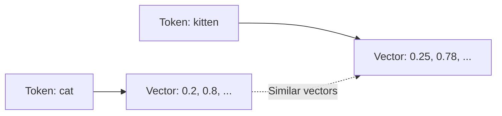

# Language Models Fundamentals (Part 1-B)

## How LLMs Generate Text

Text generation follows an **autoregressive** pattern: generate one token, append it to the sequence, repeat.

```text
Step 1: "The sky is" → predict "blue"
Step 2: "The sky is blue" → predict "today"
Step 3: "The sky is blue today" → predict "."
...continue until complete
```

---

## The Three-Step Generation Process

### Step 1: Encoding

The input text is converted into numerical vectors the model can process.

**Tokenization**: Split text into tokens (words, subwords, or characters)

```text
Input: "Hello world"
Tokens: ["Hello", " world"]
Token IDs: [15496, 995]
```

**Embeddings**: Map each token to a high-dimensional vector capturing semantic meaning.



Semantically similar words have vectors close together in the embedding space.

### Step 2: Prediction

The model processes encoded input through transformer layers, then predicts the next token.

**Softmax Layer**: Converts model outputs into a probability distribution over all possible tokens.

```text
Vocabulary: [apple, banana, cat, dog, ...]
Probabilities: [0.01, 0.02, 0.15, 0.08, ...]
                              ↑
                        Most likely
```

### Step 3: Decoding

Select a token from the probability distribution and convert back to text.

**Greedy Decoding**: Always pick the highest probability token.
**Sampling**: Randomly select based on probabilities (introduces variety).

---

## Controlling Output: Temperature, Top-K, Top-P

These parameters balance **determinism** (predictable outputs) vs **creativity** (varied outputs).

### Temperature

Controls the "sharpness" of the probability distribution.

| Temperature | Effect | Use Case |
|-------------|--------|----------|
| 0.0 | Always pick highest probability | Factual Q&A, code generation |
| 0.7 | Balanced creativity | General writing |
| 1.0+ | High randomness | Creative writing, brainstorming |

**Example**: Completing "The sky is..."

```text
Temperature 0.0: "blue" (always)
Temperature 0.7: "blue", "clear", "beautiful"
Temperature 1.2: "blue", "falling", "infinite", "painted"
```

### Top-K Sampling

Restrict selection to the **K most probable** tokens only.

```text
Top-5 tokens: [blue, clear, bright, dark, beautiful]
→ Sample only from these 5, ignore all others
```

**Trade-off**: Lower K = more focused, Higher K = more variety.

### Top-P (Nucleus Sampling)

Select from the smallest set of tokens whose cumulative probability exceeds **P**.

```text
P = 0.9
Tokens by probability: blue(0.4), clear(0.25), bright(0.15), dark(0.12)
Cumulative: 0.4 → 0.65 → 0.80 → 0.92 ✓
→ Sample from [blue, clear, bright, dark]
```

**Advantage**: Adapts dynamically—fewer tokens when model is confident, more when uncertain.

---

## Practical Parameter Guidelines

| Task Type | Temperature | Top-P | Rationale |
|-----------|-------------|-------|-----------|
| Code generation | 0.0-0.2 | 0.1 | Correctness over creativity |
| Factual Q&A | 0.0-0.3 | 0.5 | Accurate, consistent answers |
| Summarization | 0.3-0.5 | 0.8 | Faithful to source |
| Creative writing | 0.7-1.0 | 0.9 | Variety and originality |
| Brainstorming | 1.0-1.2 | 1.0 | Maximum diversity |

---

## Key Takeaways

1. **Encoding** converts text to vectors capturing semantic meaning
2. **Prediction** uses learned patterns to generate probability distributions
3. **Decoding** selects tokens and converts back to readable text
4. **Temperature** controls overall randomness (0 = deterministic)
5. **Top-K** limits to fixed number of candidates
6. **Top-P** limits by cumulative probability threshold
7. Match parameters to your task: low for accuracy, high for creativity

---

**Next**: [Base vs Instruction-Tuned vs Chat-Tuned LLMs](./02_Language-Models-Fundamentals-Part1-C.md)
