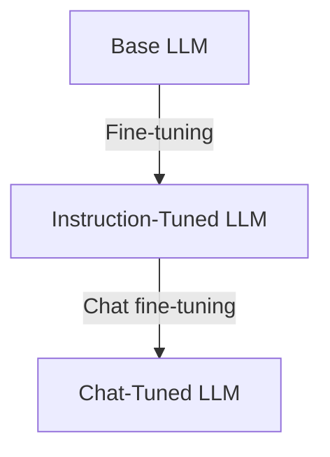

# Language Models Fundamentals (Part 1-C)

## Three Types of LLMs

Not all language models behave the same way. Understanding the differences helps you select the right model for your task.



---

## 1. Base LLMs

### What They Do

Base models are trained on vast text corpora to predict the next token. They excel at **text completion** but don't follow instructions.

### Behavior Example

```text
Prompt: "Write a story about a mountain village"

Base LLM Output:
"Write a story about a mountain village is a common 
creative writing assignment given to students in 
elementary school. Teachers often use this prompt to..."
```

The model **continues** the text rather than **following** the instruction.

### Characteristics

| Aspect | Base LLM Behavior |
|--------|-------------------|
| Training | Next-token prediction on raw text |
| Strength | Text completion, pattern matching |
| Weakness | Cannot follow instructions reliably |
| Use Case | Foundation for fine-tuning |

---

## 2. Instruction-Tuned LLMs

### What They Do

Built from base models, then **fine-tuned** on instruction-response pairs. They understand and execute commands.

### Behavior Example

```text
Prompt: "Write a story about a mountain village"

Instruction-Tuned Output:
"In a remote valley, nestled between snow-capped peaks,
lay the village of Thornhaven. Its cobblestone streets
wound past wooden cottages where smoke curled from
chimneys into the crisp morning air..."
```

The model **follows the instruction** and generates appropriate content.

### How Instruction Tuning Works

1. Start with a pre-trained base model
2. Create dataset of (instruction, expected_response) pairs
3. Fine-tune the model to produce expected responses
4. Result: Model learns to follow instructions

### Special Tokens

Many instruction-tuned models require specific formatting:

```text
<s>[INST] Write a story about a mountain village [/INST]
```

- `[INST]` marks instruction start
- `[/INST]` marks instruction end
- Formatting varies by model—check documentation

**Important**: Incorrect formatting degrades output quality significantly.

---

## 3. Chat-Tuned LLMs

### What They Do

Extended from instruction-tuned models to handle **multi-turn conversations** with memory of prior exchanges.

### Behavior Example

```text
Turn 1:
User: "Write a story about a mountain village"
Assistant: "In a remote valley lay the village of Thornhaven..."

Turn 2:
User: "Now make the main character a blacksmith"
Assistant: "In a remote valley lay Thornhaven, where Erik 
the blacksmith started each day before dawn. The ring of 
his hammer echoed through the misty streets..."
```

The model **remembers context** and incorporates new instructions.

### Characteristics

| Aspect | Chat-Tuned Behavior |
|--------|---------------------|
| Training | Conversation datasets with multiple turns |
| Strength | Context retention, natural dialogue |
| Memory | Maintains conversation history |
| Use Case | Chatbots, assistants, interactive apps |

---

## Comparison Summary

| Feature | Base | Instruction-Tuned | Chat-Tuned |
|---------|------|-------------------|------------|
| Follows instructions | ❌ | ✅ | ✅ |
| Single-turn tasks | Limited | ✅ Excellent | ✅ Good |
| Multi-turn conversation | ❌ | ❌ | ✅ |
| Remembers context | ❌ | ❌ | ✅ |
| Special tokens needed | No | Often yes | Often yes |

---

## Selecting the Right Model Type

### Use Base LLMs When:
- Building custom fine-tuned models
- Text completion tasks (autocomplete)
- Research and experimentation

### Use Instruction-Tuned When:
- Single-turn tasks (summarization, translation, Q&A)
- Structured outputs (JSON, code generation)
- No conversation history needed

### Use Chat-Tuned When:
- Interactive applications
- Multi-turn conversations
- Context-dependent follow-ups
- Conversational assistants

---

## Common Pitfalls

| Mistake | Result | Solution |
|---------|--------|----------|
| Using base model for instructions | Ignores your request | Use instruction-tuned |
| Using instruction model for chat | Forgets previous turns | Use chat-tuned |
| Wrong special token format | Poor output quality | Check model documentation |
| Expecting chat from instruction model | No context retention | Manage history manually |

---

## Key Takeaways

1. **Base LLMs** complete text but don't follow instructions
2. **Instruction-tuned LLMs** execute single commands effectively
3. **Chat-tuned LLMs** handle multi-turn conversations with context
4. Special tokens are critical for instruction-tuned models
5. Match model type to your use case for best results

---

## Related Topics

- [Generative AI Systems Overview](./01_Generative-AI-Systems-Overview-Part1-A.md)
- [RAG Architecture Fundamentals](./03_RAG-Architecture-Fundamentals-Part1-A.md)
