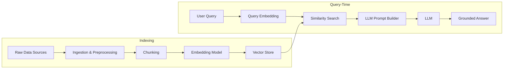

# RAG Architecture Fundamentals (Part 1)

Retrieval-Augmented Generation (RAG) combines **language models** with **external knowledge sources** so that responses can be grounded in up-to-date, domain-specific information. Instead of relying solely on what a model learned during pre-training, a RAG system retrieves relevant context at query time and injects it into the model's prompt.

This lesson focuses on the **core architecture** and **data pipeline** behind RAG so that later modules can explore optimization, evaluation, and production concerns.

## 1. High-Level RAG Flow

At a high level, a RAG system has two major phases:

1. **Offline (or background) phase** – Build and maintain a **vector store** from your documents.
2. **Online (query-time) phase** – For each user query, retrieve relevant information and generate a grounded response.



```text
ASCII Fallback:

Offline (Indexing):
  [Raw Data] -> [Ingest/Preprocess] -> [Chunk] -> [Embed] -> [Vector Store]

Online (Query-Time):
  [User Query] -> [Embed Query] -> [Similarity Search over Vector Store]
                 -> [Build Prompt with Retrieved Chunks] -> [LLM] -> [Answer]
```

The key idea is simple: **retrieve first, then generate**.

## 2. Data Ingestion and Preprocessing

The offline phase turns raw data into a structure that is easy to search at query time.

Typical data sources include:

- Markdown documents, PDFs, slide decks, or HTML pages.
- Code repositories and configuration files.
- Databases, data warehouses, or analytics platforms.
- Ticketing systems, knowledge bases, or internal wikis.

A robust ingestion pipeline usually performs:

1. **Loading** – Connect to each data source and read content.
2. **Normalization** – Convert to a common format (e.g., plain text + metadata).
3. **Cleaning** – Remove boilerplate, navigation menus, repeated headers/footers, or irrelevant sections.
4. **Segmentation / Chunking** – Split long documents into manageable chunks.
5. **Metadata enrichment** – Attach useful fields (e.g., source, section heading, timestamp, tags).

### Why Chunking Matters

Language models have a **context window limit**. Sending entire documents is:

- Expensive (more tokens).
- Noisy (irrelevant sections compete with useful ones).

Chunking strategies often consider:

- **Chunk size** – number of tokens or characters per chunk.
- **Overlap** – how much neighboring text overlaps so that concepts spanning boundaries are preserved.
- **Semantic boundaries** – splitting at headings, paragraphs, or logical sections instead of fixed sizes only.

Thoughtful chunking dramatically improves retrieval quality.

## 3. Embeddings and Vector Stores

Once you have chunks, each chunk is converted into a **vector representation** using an **embedding model**.

Characteristics of embeddings:

- They map text into a high-dimensional space where **semantic similarity** corresponds to **distance**.
- Similar pieces of text (e.g., about the same concept) end up near each other in that space.

The resulting vectors and their metadata are stored in a **vector store** (or vector database). This component usually provides:

- Fast similarity search (e.g., k-nearest neighbors, approximate nearest neighbors).
- Filtering by metadata (e.g., by user, document type, date range).
- APIs to insert, update, and delete vectorized documents.

Embedding details to consider:

- **Model choice** – multilingual vs monolingual, general-purpose vs domain-specific.
- **Embedding granularity** – per sentence, per paragraph, or per section.
- **Index configuration** – trade-offs between recall, latency, and memory.

## 🔗 Related Documents

- [Part 1-B: Query-Time Retrieval and Advanced Topics](./03_RAG-Architecture-Fundamentals-Part1-B.md) - Query-time retrieval, design decisions, and failure modes
- [Generative AI Systems Overview](./01_Generative-AI-Systems-Overview-Part1-A.md) - Introduction to generative AI pillars
