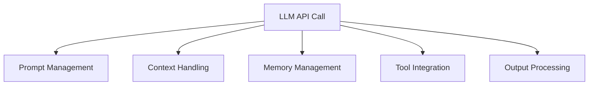
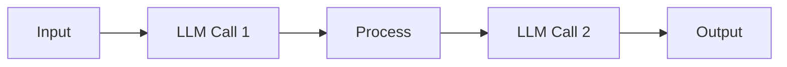

# LangChain Introduction (Part 1-A)

## What is LangChain?

**LangChain** is an orchestration framework designed to simplify building applications powered by large language models (LLMs). It provides reusable building blocks that handle common patterns in LLM application development.

### The Challenge LangChain Solves

Building LLM applications involves more than just calling an API:



LangChain abstracts these complexities into composable components.

---

## Core Purpose

LangChain enables developers to:

- **Chain operations**: Connect multiple LLM calls and tools in sequence
- **Manage context**: Handle conversation history and external data
- **Integrate tools**: Connect LLMs to databases, APIs, and other systems
- **Handle prompts**: Template and optimize prompts systematically
- **Build workflows**: Create complex multi-step LLM applications

---

## When to Use LangChain

### Use LangChain When:

✅ Building applications requiring multiple LLM interactions  
✅ Integrating LLMs with external data sources  
✅ Creating conversational agents with memory  
✅ Implementing RAG (Retrieval-Augmented Generation) systems  
✅ Building complex workflows with conditional logic  

### Consider Alternatives When:

❌ Simple single API calls (direct API usage may suffice)  
❌ One-off scripts or experiments (LangChain adds overhead)  
❌ Very specific use cases with custom requirements  

---

## Key Building Blocks

LangChain provides several core abstractions:

### 1. LLM Wrappers

Unified interface for different LLM providers:

```text
OpenAI → LangChain Wrapper → Your Application
HuggingFace → LangChain Wrapper → Your Application
Anthropic → LangChain Wrapper → Your Application
```

### 2. Prompt Templates

Structured prompt management with variable substitution:

```text
Template: "Summarize this article: {article_text}"
Variables: article_text = "Your content here"
Result: "Summarize this article: Your content here"
```

### 3. Chains

Sequential operations connecting multiple components:



### 4. Agents

LLM-powered systems that can use tools and make decisions:

```text
User Query → Agent → Decide Action → Use Tool → Process Result → Respond
```

### 5. Memory

Manage conversation history and context:

```text
Turn 1: User asks question
Turn 2: User asks follow-up (agent remembers Turn 1)
Turn 3: User references previous context (agent maintains full history)
```

---

## LangChain vs Direct API Usage

| Aspect | Direct API | LangChain |
|--------|------------|-----------|
| **Simplicity** | Simple for basic calls | More setup, more power |
| **Chaining** | Manual implementation | Built-in support |
| **Memory** | Manual management | Built-in abstractions |
| **Tool Integration** | Custom code | Pre-built integrations |
| **Learning Curve** | Low | Moderate |
| **Flexibility** | Full control | Structured patterns |

---

## Prerequisites

Before diving into LangChain, ensure you understand:

- **Language Models Fundamentals**: How LLMs work, their types, and generation process
- **Prompt Engineering**: Basic techniques for effective prompts
- **API Integration**: Working with REST APIs and authentication

---

## Next Steps

This introduction provides the foundation. Subsequent parts will cover:

- Setting up LangChain in your environment
- Building your first chain
- Working with prompts and templates
- Creating agents with tool access
- Implementing memory and context management

---

## Related Topics

- [Language Models Fundamentals](./02_Language-Models-Fundamentals-Part1-A.md) - Understanding LLMs
- [RAG Architecture Fundamentals](./03_RAG-Architecture-Fundamentals-Part1-A.md) - Retrieval-augmented generation
- [Generative AI Systems Overview](./01_Generative-AI-Systems-Overview-Part1-A.md) - AI systems context

