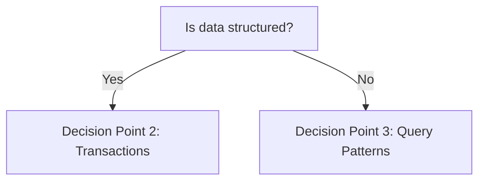
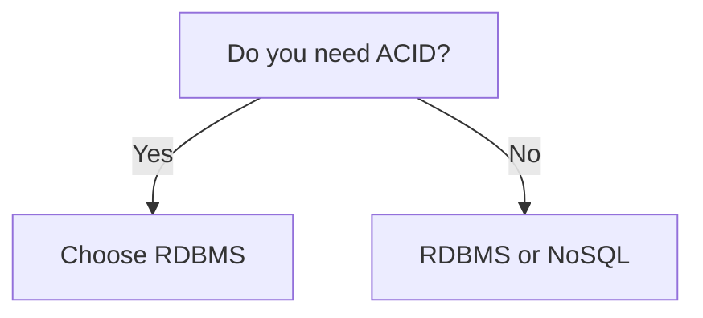
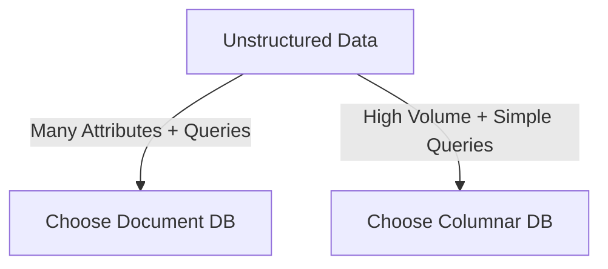

# Database Selection Decision Framework (Part 1-A-A)

## Core Principle

Database technology selection determines how effectively your system meets performance, scalability, and operational requirements. While any database can satisfy basic functional needs, the choice profoundly shapes your system's ability to handle growth, complex queries, and varying data patterns.

## Three Critical Selection Factors

### 1. Data Organization Structure

Is your information naturally tabular with fixed relationships, or does it vary in shape and format?

- **Structured**: Predictable schema, consistent fields, clear relationships
- **Unstructured**: Variable attributes, nested structures, evolving formats

### 2. Query Characteristics

What patterns define how you access and manipulate data?

- **Complex relational operations**: Joins, aggregations, transactions
- **Flexible attribute queries**: Searching across varied document structures
- **Time-range analytics**: Bulk reads over temporal ranges

### 3. Scale Trajectory

How does your data volume change over time?

- **Steady growth**: Linear or predictable increases
- **Exponential growth**: Rapidly accelerating data accumulation
- **Burst patterns**: Sudden spikes followed by periods of stability

---

## Selection Framework

### Decision Point 1: Data Structure

### Decision Point 2: Transaction Requirements

For structured data, determine if you need transactional guarantees:

### Decision Point 3: Query and Volume Patterns

For unstructured data, evaluate query diversity and growth:

---

**Next**: [Database Type Characteristics](./01_Database-Selection-Decision-Framework-Part1-A-B.md)
