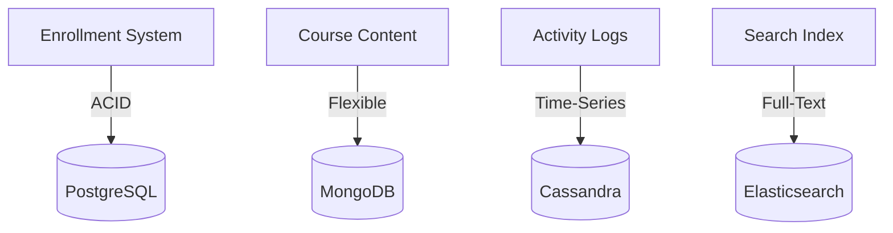

# Database Selection Decision Framework (Part 1-B-B)

## Practical Example: Online Learning Platform

### System Requirements

An educational platform needs to:
1. Manage course enrollments with transactional integrity
2. Store course content with varying structures
3. Track student progress over time
4. Support flexible search across courses

### Database Selection

**Enrollment Management → RDBMS (PostgreSQL)**
- Requirement: Prevent double-booking when course capacity is limited
- Solution: ACID transactions ensure only one student can claim the last available seat
- Schema: Fixed structure (student_id, course_id, enrollment_date, status)

**Course Content → Document DB (MongoDB)**
- Requirement: Courses have different metadata (video courses vs. text-based vs. interactive)
- Solution: Flexible schema accommodates varying course structures
- Example: Video courses have duration/tags, text courses have page counts, interactive courses have exercise counts

**Progress Tracking → Columnar DB (Cassandra)**
- Requirement: Continuous logging of student activity (clicks, views, completions)
- Solution: High write throughput for time-series activity data
- Pattern: Ever-increasing data as students interact with courses

**Search Functionality → Search Engine (Elasticsearch)**
- Requirement: Full-text search across course titles, descriptions, tags
- Solution: Specialized search engine for text queries
- Note: Data synced from primary stores, not primary source of truth

### Complete Architecture

---

## Selection Guidelines

1. **Start with data patterns**: Analyze structure, relationships, and growth trajectory
2. **Identify transaction needs**: Determine if ACID guarantees are required
3. **Evaluate query patterns**: Understand access patterns and query complexity
4. **Consider scale requirements**: Project data volume and growth rate
5. **Plan for combination**: Most systems benefit from multiple database types
6. **Factor in operational complexity**: Consider team expertise and infrastructure

---

## Related Topics

- [Part 1-A-A: Selection Framework](./01_Database-Selection-Decision-Framework-Part1-A-A.md)
- [Additional Storage Types](./02_Additional-Storage-Types-Part1-A-A-A.md)
- [Sharding](../../03_Interview-Prep/01_Glossary/01_Interview-Glossary-Part1-A.md#sharding)
- [Replication](../../03_Interview-Prep/01_Glossary/01_Interview-Glossary-Part1-A.md#replication)
