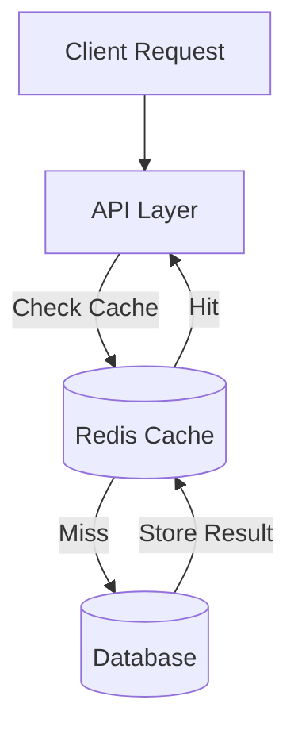

# Additional Storage Types (Part 1-A-A-A)

## Overview

Beyond primary databases, systems often require specialized storage solutions optimized for specific access patterns. This section covers performance optimization through caching.

---

## 1. In-Memory Caching Systems

### Purpose

Caching systems store frequently accessed data in fast, volatile memory to reduce expensive operations like database queries or external API calls.

### When Caching Helps

- **Repeated identical queries**: Same data requested multiple times
- **Expensive computations**: Results of complex calculations or aggregations
- **External service calls**: Responses from third-party APIs with latency
- **Session state**: Temporary user session information
- **Rate limiting data**: Request counts and throttling information

### How Caching Operates

Caching follows a simple lookup model:
- **Cache Key**: Represents the query parameters or request identifier
- **Cache Value**: The computed result or fetched data
- **Lookup Process**: Check cache first; if missing, compute/fetch and store

### Technology: Redis

Redis is a widely-adopted in-memory data store offering:

- **Multiple data structures**: Strings, lists, sets, sorted sets, hashes
- **Pub/Sub messaging**: Real-time event distribution
- **Optional persistence**: Can write to disk for durability
- **Clustering support**: Distribute load across multiple nodes
- **Low latency**: Sub-millisecond response times

### Alternative Solutions

- **Memcached**: Simple key-value caching
- **etcd**: Distributed configuration and coordination store
- **Hazelcast**: In-memory computing platform

### Common Use Cases

- **Session management**: Store user login sessions
- **API response caching**: Cache external service responses
- **Leaderboards**: Maintain real-time rankings
- **Rate limiting**: Track and enforce request limits
- **Temporary data**: Shopping cart contents, form drafts

### Architecture Pattern

---

**Next**: [Binary Object Storage](./02_Additional-Storage-Types-Part1-A-A-B.md)
