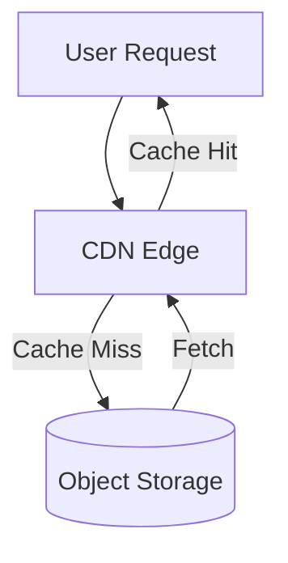

# Additional Storage Types (Part 1-A-A-B)

## 2. Binary Object Storage

### Purpose

Binary object storage handles large files that don't require querying—images, videos, documents, and other binary content that is served directly to clients.

**Critical Distinction**: Object storage is not a database. It stores files for retrieval, not for querying or relational operations.

### When to Use Object Storage

- **Media assets**: Photos, videos, audio files
- **Document storage**: PDFs, Office documents, archives
- **User-generated content**: Profile pictures, uploaded files
- **Backup archives**: Database backups, log files
- **Static resources**: Large binary assets (though CDNs are preferred for frequent access)

### Technology: Object Storage Services

Cloud providers offer object storage services:

- **Azure Blob Storage**: Microsoft's scalable object storage for cloud-native workloads, archives, and data lakes.
- **Amazon S3 (Simple Storage Service)**: Industry-standard object storage service offering high durability and availability.
- **Google Cloud Storage**: Unified object storage for developers and enterprises.

**Key Features**:
- **Scalability**: Virtually unlimited capacity
- **Durability**: Extremely high data persistence guarantees
- **Cost efficiency**: Pay-per-use pricing models
- **Access control**: Granular permission systems
- **Versioning**: Maintain multiple file versions
- **Lifecycle management**: Automatic archival policies

### Content Delivery Networks (CDNs)

CDNs complement object storage by distributing content geographically:

**How CDNs Work**:
1. Origin server (object storage) holds the master copy
2. CDN replicates content to edge locations worldwide
3. Users receive content from nearest edge location
4. Edge locations cache frequently accessed content

**Benefits**:
- **Reduced latency**: Content served from nearby locations
- **Lower bandwidth costs**: Traffic distributed across edge locations
- **Improved availability**: Multiple locations provide redundancy
- **Traffic handling**: CDNs designed for high request volumes

### Architecture Flow

---

**Next**: [Full-Text Search Engines](./02_Additional-Storage-Types-Part1-A-B.md)
