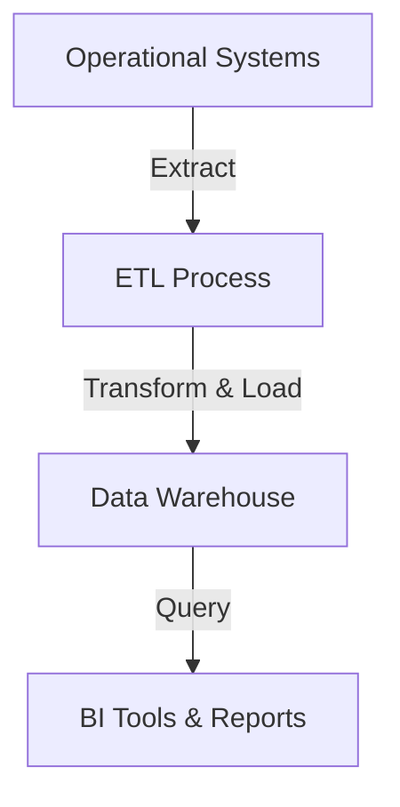

# Additional Storage Types (Part 1-B-B)

## 5. Data Warehouses

### Purpose

Data warehouses store large volumes of historical data for analytical processing, business intelligence, and reporting. They are designed for batch-oriented analytical workloads, not real-time transactional operations.

### When Data Warehouses Are Appropriate

- **Historical analysis**: Long-term trend analysis and pattern discovery
- **Business reporting**: Generate reports on company-wide metrics
- **Cross-system analytics**: Combine data from multiple operational systems
- **Regulatory compliance**: Long-term data retention requirements
- **Data science**: Training machine learning models on historical data

### Key Characteristics

- **Columnar storage**: Optimized for analytical queries that read many rows but few columns
- **Parallel processing**: Distribute queries across multiple nodes
- **Batch-oriented**: Designed for large batch jobs, not real-time queries
- **Schema flexibility**: Can handle diverse data types with schema-on-read
- **Cost-effective storage**: Store petabytes of data economically

### Technology: Hadoop Ecosystem

Apache Hadoop provides a framework for distributed storage and processing:

**Core Components**:
- **HDFS**: Distributed file system for storing large datasets
- **MapReduce**: Framework for batch processing across clusters
- **YARN**: Resource management and job scheduling

**Related Technologies**:
- **Hive**: SQL interface for querying Hadoop data
- **Spark**: Fast in-memory processing engine
- **HBase**: NoSQL database built on HDFS
- **Pig**: High-level scripting for data transformations
- **Impala**: Fast SQL queries on Hadoop data

### Modern Cloud Alternatives

- **Snowflake**: Cloud-native data warehouse with separation of storage and compute
- **BigQuery**: Serverless data warehouse with automatic scaling
- **Redshift**: Managed data warehouse service
- **Azure Synapse**: Integrated analytics platform
- **Databricks**: Unified analytics and data science platform

### Typical Use Cases

- **Financial reporting**: Monthly revenue reports, expense analysis
- **Customer analytics**: User behavior analysis, segmentation studies
- **Product analytics**: Feature adoption, A/B test results
- **Operational metrics**: System performance trends, capacity planning
- **Compliance reporting**: Regulatory data retention and audit trails

### Data Flow Pattern

**Flow**: Extract data from operational databases → Transform and clean → Load into warehouse → Query for analytics and reporting

---

## Complete Storage Architecture

Production systems typically combine multiple storage types:

1. **RDBMS**: Transactional data requiring ACID guarantees
2. **Document DB**: Flexible content with varying structures
3. **Columnar DB**: High-volume time-series or event data
4. **Cache**: Frequently accessed data for performance
5. **Object Storage**: Binary files and media assets
6. **CDN**: Geographically distributed content delivery
7. **Search Engine**: Full-text search capabilities
8. **Time-Series DB**: Metrics and monitoring data
9. **Data Warehouse**: Historical analytics and reporting

**Principle**: Select storage technology based on data characteristics and access patterns. No single solution addresses all requirements.

---

## Selection Guidelines

1. **Identify primary data patterns**: Determine main database type based on structure and query needs
2. **Add performance layers**: Introduce caching for frequently accessed data
3. **Handle binary content**: Use object storage with CDN for media files
4. **Enable search**: Integrate search engine if full-text search is required
5. **Track metrics**: Use time-series database for monitoring and metrics
6. **Support analytics**: Deploy data warehouse for historical analysis
7. **Explain rationale**: Articulate why each storage type fits its use case

---

## Related Topics

- [Part 1-A-A-A: Caching](./02_Additional-Storage-Types-Part1-A-A-A.md)
- [Part 1-A-A-B: Object Storage](./02_Additional-Storage-Types-Part1-A-A-B.md)
- [Part 1-A-B: Full-Text Search](./02_Additional-Storage-Types-Part1-A-B.md)
- [Database Selection Framework](./01_Database-Selection-Decision-Framework-Part1-A.md)

