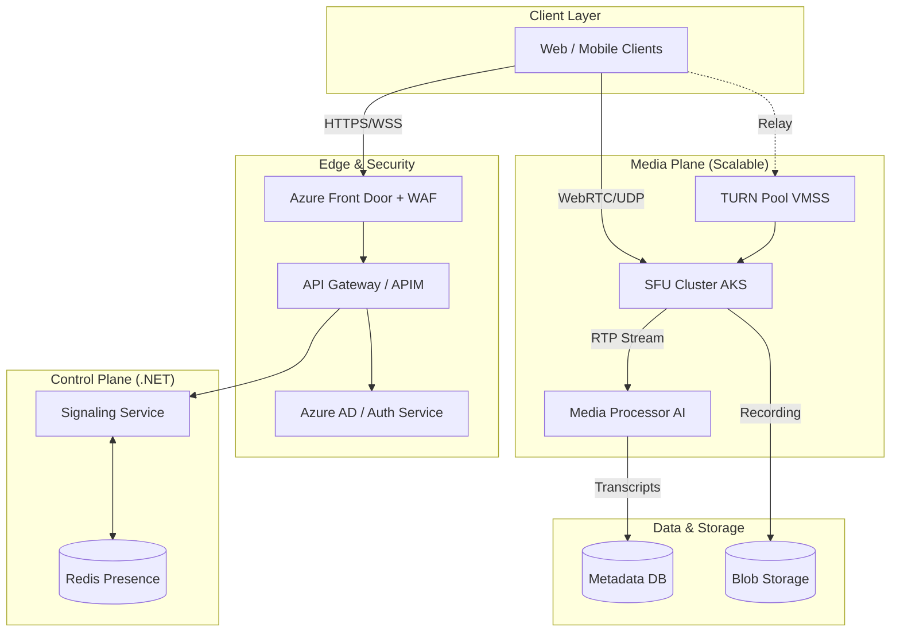

# System Design: AI-Enhanced Video Conferencing - Part 1-B

## 2. High-Level Architecture Components (Part 2)

### Data & Storage

* **Postgres**: Relational database for structured data.
  * **Use Cases**: User profiles, Meeting metadata (start/end time, participants), Chat logs, Tenant config.
  * **Scaling**: Read replicas for high read traffic (e.g., dashboard views).
* **Blob Storage**: Object storage for unstructured data.
  * **Use Cases**: Video recordings (MP4/WebM), Shared files, Transcripts.
  * **Technology**: Azure Blob Storage / AWS S3.
  * **Lifecycle**: Hot tier for recent meetings, Cool/Archive tier for older recordings.
* **Redis**: In-memory cache.
  * **Use Cases**: Session state, real-time presence (who is online), meeting status.

### AI Services (The "AI Architect" Focus)

* **Azure AI Services**:
  * **Speech-to-Text**: For real-time transcription.
    * **Pattern**: Stream audio chunks -> STT API -> Text stream.
  * **Translation**: For live language translation.
    * **Pattern**: Text stream -> Translation API -> Translated Text -> Broadcast to clients.
  * **Content Safety**: For moderating text/audio.
    * **Use Case**: Detect PII or toxic language in real-time.

### Observability

* **Prometheus**: Metric collection.
  * **Metrics**: QPS, Latency, Error rates, Active meetings, Connected users.
* **Grafana**: Visualization.
  * **Dashboards**: "System Health", "AI Usage Costs", "Tenant Usage".
* **Distributed Tracing**: Jaeger / Azure Monitor.
  * **Goal**: Trace a request from Client -> Gateway -> Meeting Service -> AI Service.

## 3. Architecture Diagram (Mermaid)

