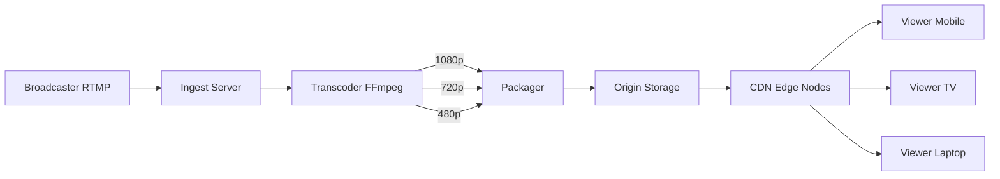

# Detailed Design: Advanced Scenarios

## 1. Group Call Architecture

Scaling from 1:1 to N:N requires different architectural patterns based on the number of participants.

### A. Mesh Topology (Peer-to-Peer)

* **Concept**: Every participant connects directly to every other participant.
* **Bandwidth Cost**: $(N-1)$ uplinks and $(N-1)$ downlinks per user.
* **Suitability**: Small groups (N ≤ 5).
* **Pros**: Low latency, low server cost (only signaling).
* **Cons**: CPU and bandwidth intensive for clients.

### B. SFU (Selective Forwarding Unit)

* **Concept**: Participants send **one** uplink stream to a central server (SFU). The SFU forwards that stream to all other participants.
* **Bandwidth Cost**: 1 uplink and $(N-1)$ downlinks per user.
* **Suitability**: Medium to Large groups (5 < N < 50).
* **Pros**: Reduces client uplink load. Enables features like recording and simulcast.
* **Cons**: Higher server bandwidth costs.

### C. MCU (Multipoint Control Unit)

* **Concept**: The server mixes all incoming streams into a single composite video stream and sends it back.
* **Bandwidth Cost**: 1 uplink and 1 downlink per user.
* **Suitability**: Legacy systems or very low bandwidth clients.
* **Pros**: Lowest client bandwidth.
* **Cons**: Extremely high server CPU cost (decoding + mixing + encoding). High latency.

**Decision**: We will use a **Hybrid Approach**.

* **N ≤ 5**: Attempt P2P Mesh.
* **N > 5**: Switch to SFU (via Azure Communication Services or LiveKit).

## 2. Live Streaming Architecture (One-to-Millions)

For broadcasting events (e.g., Sports, Town Halls) to millions of users, WebRTC is not scalable. We use a **CDN-based delivery** with HLS/DASH.

### Architecture Flow

1. **Ingest**: The broadcaster sends a high-quality RTMP/SRT stream to an **Ingest Server**.
2. **Transcoding**: The stream is converted into multiple bitrates/resolutions (1080p, 720p, 480p) for **Adaptive Bitrate Streaming (ABR)**.
3. **Packaging**: Transcoded streams are segmented into small chunks (2-6 seconds) and manifest files (.m3u8 / .mpd) are created.
4. **Distribution**: Chunks are pushed to a **CDN (Content Delivery Network)** (e.g., Azure CDN, Cloudflare).
5. **Playback**: Viewers fetch chunks from the nearest CDN edge node using HLS (HTTP Live Streaming) or DASH.

## 3. Adaptive Bitrate & Transcoding

To support users with varying network conditions, we implement **Simulcast** (for SFU) and **ABR** (for HLS).

* **Simulcast (WebRTC)**: The sender publishes multiple qualities (High, Med, Low) to the SFU. The SFU detects the receiver's bandwidth and forwards the appropriate stream.
* **ABR (HLS/DASH)**: The player detects available bandwidth and automatically switches between quality levels defined in the manifest file.

### Handling Network Fluctuations

* **Client-Side**: The application monitors packet loss and RTT. If thresholds are exceeded, it requests a lower quality stream or disables video.
* **Server-Side**: The SFU drops video packets (falling back to audio-only) if the downlink is congested.
