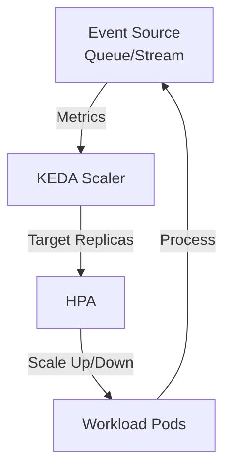

# Glossary and KEDA Guide for .NET Architect - Part 1-B

**KEDA Deep Dive and Interview Keywords** for .NET Architect interviews.

---

## 🔄 KEDA Deep Dive

### What KEDA Does

KEDA extends Kubernetes autoscaling by:

- **Listening to event sources**: Service Bus, Kafka, Event Hub, Storage Queue, Redis, HTTP, Cron, and 50+ other scalers
- **Reading event metrics**: Queue depth, message lag, pending requests
- **Updating HPA**: Feeds metrics to Horizontal Pod Autoscaler
- **Enabling scale-to-zero**: Allows pods to scale down to zero when no work exists
- **Rapid scale-out**: Scales up instantly when events arrive

### How KEDA Works

### 30-Second Interview Explanation

"KEDA stands for Kubernetes Event-Driven Autoscaling. It extends Kubernetes by letting applications scale based on external event sources—like queue depth, messages, Kafka lag, or schedules—instead of only CPU or memory. KEDA works alongside HPA, enabling fast scale-out, scale-to-zero, and cost-efficient event-driven workloads. It's essential in modern cloud systems where workloads spike when events arrive, such as document processing, IoT ingestion, or asynchronous AI pipelines."

### When to Use KEDA

- Event-driven .NET worker services
- LLM batch workloads (summaries, translations, RAG updates)
- Document ingestion and AI processing
- High-spike workloads (end-of-month billing, reports)
- IoT ingestion and stream processing
- Cost-saving autoscale-to-zero scenarios

### Key Interview Talking Points

- Works with HPA (KEDA feeds metrics → HPA performs scaling)
- Supports 50+ scalers (Azure, AWS, Kafka, Prometheus, SQL, HTTP, Cron)
- Enables true event-driven scaling → elasticity
- Ideal for microservices, data engineering, AI pipelines
- Cost-efficient: scale to zero when no work

---

## 🎯 Interview Keywords

Memorize these phrases for interviews:

- "Event-driven autoscaling"
- "Scale-to-zero"
- "External metrics adapters"
- "KEDA + HPA = dual autoscaling"
- "Queues, Kafka lag, message rate"
- "Azure Service Bus scaler"
- "Asynchronous AI workloads"

---

**Next**: [Cheat Sheet](./06_Cheat-Sheet.md)
