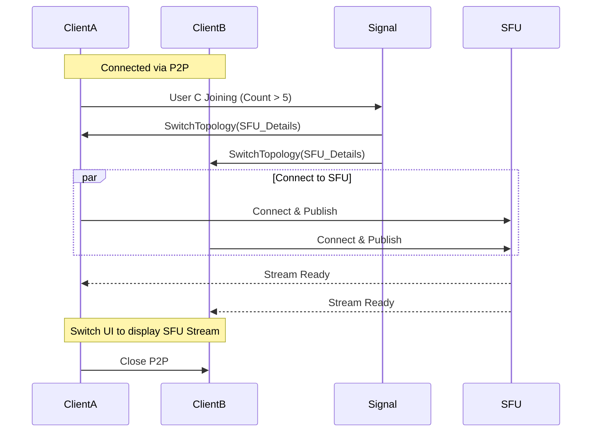
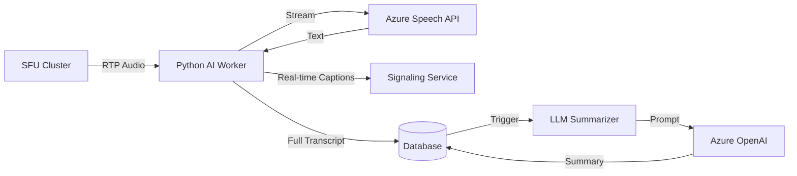

# Detailed Design: Advanced Workflows & AI Integration - Part 1-G

## 1. Dynamic Switching (P2P <-> SFU)

A key optimization is dynamically switching between Peer-to-Peer (Mesh) and
Server-Based (SFU) topologies based on network conditions or participant count.

### Trigger Conditions

1. **Participant Count**: If N > 5, switch to SFU.
2. **Network Instability**: If packet loss > 5% on P2P link, switch to SFU
   (which may have a better route).
3. **Feature Request**: If a user starts "Recording", switch to SFU (server
   needs the stream).

### Switching Workflow

The transition must be seamless. We use a "Make before Break" approach.

1. **Detection**: Client or Server detects a trigger condition (e.g., 6th
   person joins).
2. **Signaling**: Server sends `SwitchTopology` command to all clients with
   SFU credentials.
3. **Connection**: Clients establish connection to SFU *while keeping P2P
   active*.
4. **Stream Switch**: Once SFU connection is stable, clients switch their
   `MediaStreamTrack` source to the SFU stream.
5. **Teardown**: Clients close the P2P connections.

## 2. Recording Pipeline

Recording is not just "saving to disk". It involves capturing, buffering,
merging, and storing.

### Architecture

1. **Logger Service (Ingest)**:
   * Receives RTP packets from the SFU (or acts as a silent participant).
   * Buffers packets in memory/local disk (Jitter Buffer).
   * Writes raw chunks (e.g., `.webm` or `.ts`) to a **Temporary Storage**
     (Hot Blob / DFS).
2. **File Creator (Processor)**:
   * Listens for `MeetingEnded` event.
   * Retrieves all chunks for the `meetingId`.
   * **Transcoding/Merging**: Uses FFmpeg to merge audio/video tracks and
     multiple chunks into a single `.mp4` file.
   * **Upload**: Pushes final file to **Permanent Storage** (Cold Blob).
3. **Notification**:
   * Updates `Session` record in DB with `recordingUrl`.
   * Notifies users via Email/Push.

### Data Flow

`SFU` -> (RTP) -> `Logger Service` -> (Chunks) -> `Temp Blob` ->
`File Creator` -> (FFmpeg) -> `Final Blob`

## 3. AI Worker Design (Python)

We use Python for its rich AI ecosystem (PyTorch, Azure SDKs). These workers
operate asynchronously.

### Components

1. **Audio Ingest**:
   * SFU forwards a dedicated audio stream (mixed or single user) to the
     **AI Worker**.
   * Protocol: RTP or gRPC stream.
2. **Transcription Worker (FastAPI + Azure Speech)**:
   * Receives audio stream.
   * Uses **Azure Cognitive Services (Speech-to-Text)** or local **Whisper**
     model.
   * Generates real-time captions (sent back via WebSocket) and a final
     transcript (saved to DB).
3. **Summarization Worker (LLM)**:
   * Triggered after meeting ends.
   * Reads the full transcript.
   * Uses **Azure OpenAI (GPT-4)** to generate:
     * Summary
     * Action Items
     * Sentiment Analysis
   * Saves results to `MeetingMetadata` table.

### Python Worker Architecture

### Tech Stack for AI Workers

* **Runtime**: Python 3.11+
* **Framework**: FastAPI (for health checks/control), `aiortc` (for
  WebRTC/RTP handling).
* **Libraries**: `azure-cognitiveservices-speech`, `openai`, `langchain`.
* **Deployment**: Kubernetes Pods (Autoscaled on CPU/GPU usage).
